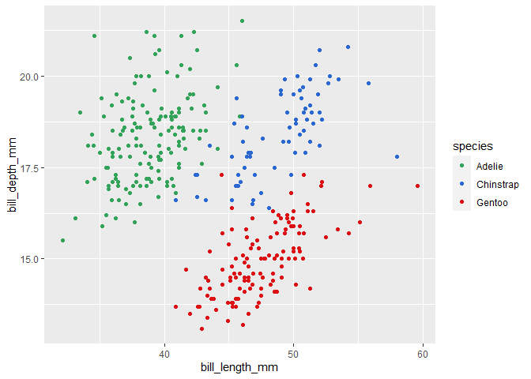

<!-- README.md is generated from README.Rmd. Please edit that file -->

# Ibrrra

<!-- badges: start -->
<!-- badges: end -->

The goal of Ibrrra is to provide a custom color palette to be used with
ggplot2 discrete and continuous color and fill scales. The colors are:
“red”, “blue”, “green”, “grey”, and “yellow”.

## Installation

You can install the development version of Ibrrra with:

``` r
remotes::install_github("etc5523-2021/r-package-takehome-imalh2")
```

## Examples

Generate vector of colors from the color palette. Specify number of
colors using the `n` argument (maximum 5)

``` r
library(Ibrrra)
ibrrra_palette()(3)
#> [1] "#DD1114" "#2868D0" "#33A35A"
```

Reverse the order of colors by specifying `direction` = -1

``` r
library(Ibrrra)
ibrrra_palette(direction = -1)(3)
#> [1] "#33A35A" "#2868D0" "#DD1114"
```

Provide a discrete color scale to ggplot2

``` r
library(Ibrrra)
library(ggplot2)
library(palmerpenguins)

p <- ggplot(penguins, aes(bill_length_mm, bill_depth_mm, color = species)) +
  geom_point()

p + scale_colour_ibrrra_d()
```


``` r
# reverse color order using direction = -1
p + scale_colour_ibrrra_d(direction = -1)
```



Provide a discrete fill scale to ggplot2

``` r
library(Ibrrra)
library(ggplot2)
library(palmerpenguins)

p <- ggplot(penguins, aes(sex, fill = species)) +
  geom_bar()

p + scale_fill_ibrrra_d()
```


``` r
# reverse color order using direction = -1
p + scale_fill_ibrrra_d(direction = -1)
```


Provide a continuous color scale to ggplot2

``` r
library(Ibrrra)
library(ggplot2)
library(palmerpenguins)

p <- ggplot(penguins, aes(bill_length_mm, bill_depth_mm, color = flipper_length_mm)) +
  geom_point()

p + scale_colour_ibrrra_seq_c("red")
```


``` r
# reverse color order using direction = -1 and increase luminescence using amount
p + scale_colour_ibrrra_seq_c("red", direction = -1, amount = 0.8)
```


